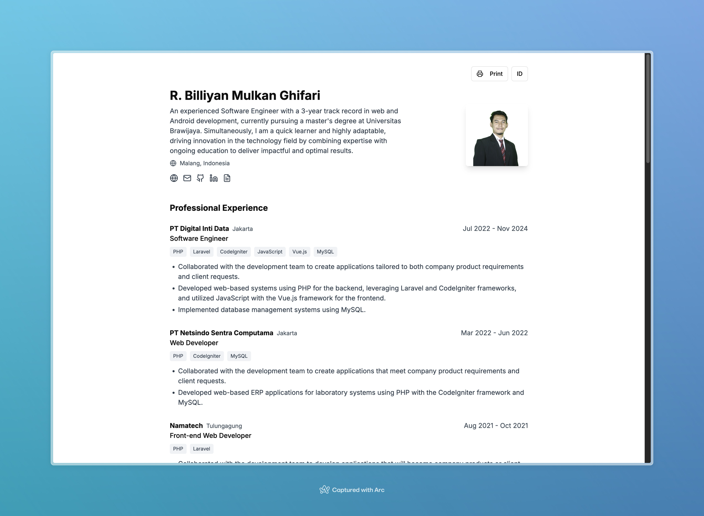

# CV - Web App

## Overview
This repository contains the online CV. 
This CV is built using Next.js 14 to showcase professional skills and experiences.

## Features
- **Responsive Design**: Fully responsive layout, compatible with all devices.
- **Open Source**: Anyone is free to use and modify this project under the terms of the MIT license.

## Technologies Used
- Next.js 14
- CSS Modules
- Tailwind Css
- Hosted on Vercel

## Connect with Me
[LinkedIn](https://www.linkedin.com/in/r-billiyan-mulkan-ghifari/) | [Github Page](https://ybiill.github.io/) | [Instagram](ybwhocodes)

Created with ❤️ by ybcodes.
